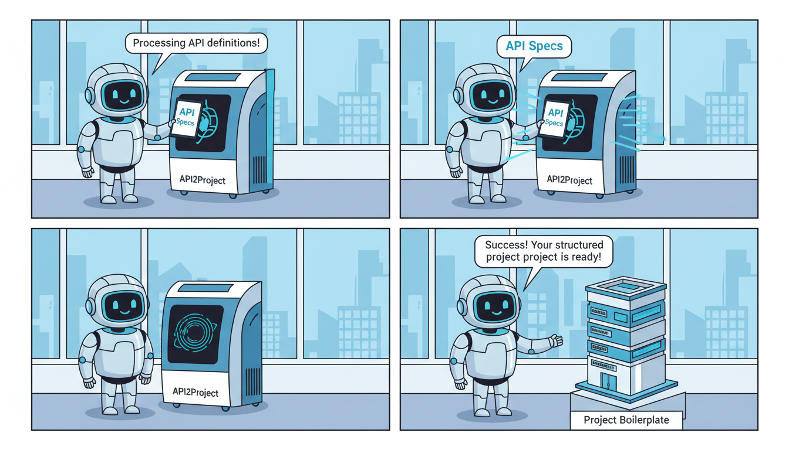

# api2project-backend

[](https://github.com/your-username/api2project-backend/actions/workflows/google-cloudrun-docker1.yml)

**api2project-backend** is the core engine for the API2Project platform. It provides a robust RESTful API designed to automate the transformation of API specifications or existing endpoints into fully structured project boilerplates, documentation, or client libraries.

Built with Python and containerized for seamless deployment, this backend handles the heavy lifting of parsing, code generation, and project scaffolding.

---

## 🚀 Features

- **Project Scaffolding**: Automatically generate project structures from API definitions.
- **RESTful API**: Clean and documented endpoints for integration with the frontend.
- **Containerized Architecture**: Fully Dockerized for consistent environments across development and production.
- **CI/CD Integration**: Pre-configured GitHub Actions for automated deployment to Google Cloud Run.
- **Environment Management**: Secure configuration using `.env` files.

---

## 🛠 Tech Stack

- **Language:** [Python 3.9+](https://www.python.org/)
- **Framework:** Flask/FastAPI (Core logic in `app.py`)
- **Infrastructure:** [Docker](https://www.docker.com/)
- **Cloud:** [Google Cloud Run](https://cloud.google.com/run)
- **CI/CD:** GitHub Actions

---

## 📁 Repository Structure

```text
api2project-backend/
├── .github/workflows/   # CI/CD pipelines (Google Cloud Run)
├── app.py               # Main application entry point & routes
├── Dockerfile           # Containerization configuration
├── requirements.txt     # Python dependencies
├── .env                 # Environment variables (not tracked in Git)
└── README.md            # Project documentation
```

---

## ⚙️ Getting Started

### Prerequisites

- Python 3.9 or higher
- Docker (optional, for containerized execution)
- A Google Cloud Platform account (for deployment)

### Local Installation

1. **Clone the repository:**
   ```bash
   git clone https://github.com/your-username/api2project-backend.git
   cd api2project-backend
   ```

2. **Create and activate a virtual environment:**
   ```bash
   python -m venv venv
   source venv/bin/activate  # On Windows: venv\Scripts\activate
   ```

3. **Install dependencies:**
   ```bash
   pip install -r requirements.txt
   ```

4. **Configure environment variables:**
   Create a `.env` file in the root directory:
   ```env
   DEBUG=True
   PORT=8080
   SECRET_KEY=your_super_secret_key
   # Add other project-specific variables here
   ```

5. **Run the application:**
   ```bash
   python app.py
   ```
   The server will typically start at `http://localhost:8080`.

---

## 🐳 Docker Usage

To run the application using Docker:

1. **Build the image:**
   ```bash
   docker build -t api2project-backend .
   ```

2. **Run the container:**
   ```bash
   docker run -p 8080:8080 --env-file .env api2project-backend
   ```

---

## 📡 API Endpoints (Example)

| Method | Endpoint | Description |
| :--- | :--- | :--- |
| `GET` | `/` | Health check / Welcome message |
| `POST` | `/api/v1/generate` | Generates a project based on a JSON payload |
| `GET` | `/api/v1/templates` | Returns available project templates |

### Example Usage

**Request:**
```bash
curl -X POST http://localhost:8080/api/v1/generate \
     -H "Content-Type: application/json" \
     -d '{
           "project_name": "my-awesome-api",
           "language": "python",
           "framework": "fastapi"
         }'
```

**Response:**
```json
{
  "status": "success",
  "download_url": "https://storage.googleapis.com/api2project/builds/my-awesome-api.zip",
  "message": "Project generated successfully."
}
```

---

## 🚢 Deployment

This repository includes a GitHub Action workflow `.github/workflows/google-cloudrun-docker1.yml` which automates deployment to **Google Cloud Run**.

### To trigger a deployment:
1. Ensure you have set up the following secrets in your GitHub repository:
   - `GCP_PROJECT_ID`
   - `GCP_SA_KEY` (Service Account Key)
2. Push changes to the `main` branch.
3. The workflow will build the Docker image, push it to Google Container Registry (GCR), and deploy it to Cloud Run.

---

## 🤝 Contributing

1. Fork the project.
2. Create your Feature Branch (`git checkout -b feature/AmazingFeature`).
3. Commit your changes (`git commit -m 'Add some AmazingFeature'`).
4. Push to the Branch (`git push origin feature/AmazingFeature`).
5. Open a Pull Request.

---

## 📄 License

This project is licensed under the MIT License - see the LICENSE file for details.

---
**Maintained by [Your Name/Organization]**